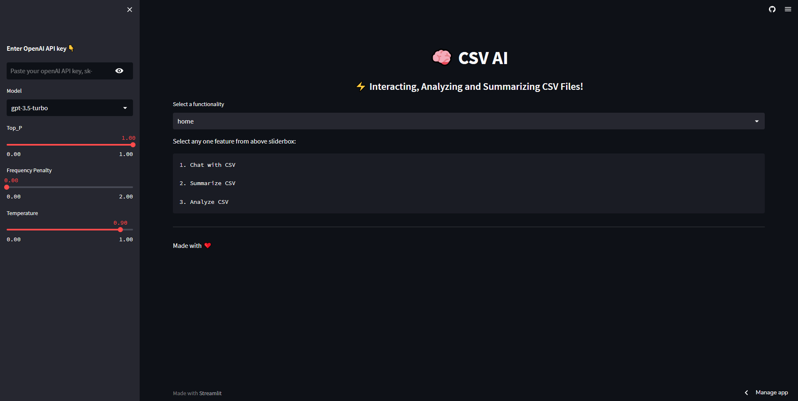

# CSV-AI 🧠

CSV-AI is the ultimate app powered by LangChain, OpenAI, and Streamlit that allows you to unlock hidden insights in your CSV files. With CSV-AI, you can effortlessly interact with, summarize, and analyze your CSV files in one convenient place. 

## Features

CSV-AI offers the following key features:

- **Interact:** Easily navigate through your CSV files and interact with the data.
- **Summarize:** Generate descriptive summaries for your CSV data.
- **Analyze:** Perform advanced data analysis on your CSV files, including filtering, sorting, and visualizing the data.

## Installation

To run CSV-AI, follow these steps:

1. Clone this repository to your local machine.
2. Navigate to the project directory.

```bash
git clone https://github.com/Safiullah-Rahu/CSV-AI.git
cd csv-ai
```
3. Install the required packages using `pip` with the provided `requirements.txt` file.
```bash 
pip install -r requirements.txt
```
## Usage

To start CSV-AI, run the following command:
```bash 
streamlit run app.py
```
This command will launch the CSV-AI app in your default web browser. You can then start exploring and analyzing your CSV files.



## Feedback and Contributions
If you have any feedback, suggestions, or issues related to CSV-AI, please open an issue on the GitHub repository. Contributions are also welcome! If you would like to contribute to CSV-AI, please follow the guidelines outlined in the Contribution Guidelines.

## License
CSV-AI is licensed under the MIT License.
